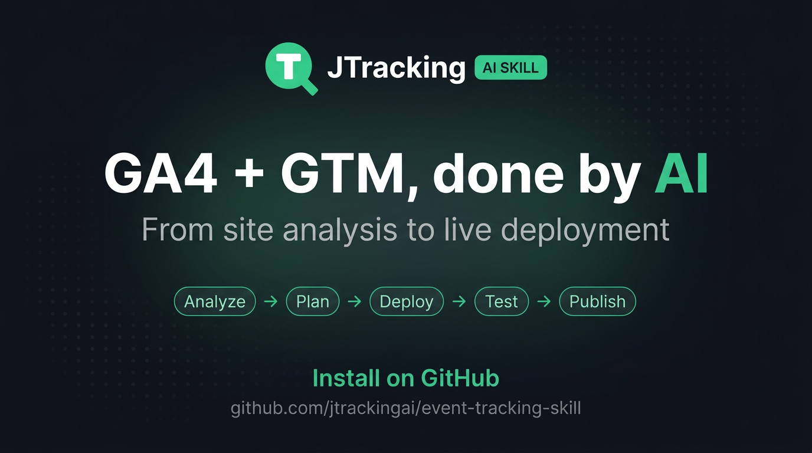

<p align="center">
  
</p>
<p align="center">
  <b>GA4 + GTM, done by AI. From site analysis to go live.</b><br/>
  Works with Cursor · Codex · Any AI Agent
</p>
<p align="center">
  <a href="#what-you-get">What You Get</a> ·
  <a href="#installation">Installation</a> ·
  <a href="#quick-start">Quick Start</a> ·
  <a href="#quick-debug-tips">Quick Debug Tips</a> ·
  <a href="https://www.jtracking.ai/skills">Website</a>
</p>

# Analytics Tracking Automation

`analytics-tracking-automation` is a local-first AI skill for planning, reviewing, and delivering GA4 + GTM tracking.

Use it when you want an agent to help with:

- analyzing a site before tracking work starts
- grouping pages by business purpose
- designing or reviewing a GA4 event plan
- comparing a proposed plan with an existing live GTM setup
- preparing GTM-ready outputs and verification guidance
- handling both generic websites and Shopify storefronts

This README is intentionally user-facing and conversation-first.
If you need the CLI surface or maintainer workflow, use [DEVELOPING.md](DEVELOPING.md).

## What You Get

For a given website, this skill can help produce:

- a reviewable site analysis
- business-friendly page groups
- a compact, decision-ready tracking plan
- GTM-ready tracking outputs
- verification and health summaries before go-live
- artifact-backed progress that can be resumed later

## Installation

Most users only need the umbrella skill.

### Recommended

Clone the repository locally, then install the skill into your agent skills directory:

```bash
git clone https://github.com/jtrackingai/analytics-tracking-automation.git
cd analytics-tracking-automation
npm run install:skills
```

### No-Clone Alternative

If you do not want to clone the repository, install the root skill directly:

```bash
npx skills add jtrackingai/analytics-tracking-automation
```

For advanced install options and exported skill bundles:

- [docs/README.install.md](docs/README.install.md)
- [docs/skills.md](docs/skills.md)

### ClawHub Publish

If you are publishing this skill to ClawHub, publish the exported public bundle instead of the full repository:

```bash
npm run export:skills:clawhub
```

Then upload `dist/clawhub-skill-bundles/analytics-tracking-automation`.

That public bundle is a publish-safe skill bundle. It keeps the agent-facing skill docs and references while stripping bundled executable runtime files (CLI bootstrap, packaged node modules, telemetry transport, and updater runtime) that tend to trigger stricter marketplace security scans.

When users install/use this public ClawHub bundle, they must run this prerequisite first (before any `event-tracking` command):

```bash
npx skills add jtrackingai/analytics-tracking-automation
```

## Quick Start

### Use It As A Skill

The intended experience is simple: tell your agent what you want in plain language.

Good requests usually include one or more of:

- the site URL
- whether this is a new setup, update, upkeep, or audit
- the output root for a new site run, such as `./output` or `/tmp/output`
- an existing site artifact directory if you already have one, such as `./output/example_com`
- GA4 measurement ID or GTM context when you already know them
- any scope boundary such as "stop after schema review"

For a new setup, the output root is not the artifact directory itself. The agent/CLI creates one artifact directory per site under that root, for example `./output/example_com`.

### Example Prompts

New setup from scratch:

```text
Use analytics-tracking-automation to plan GA4 + GTM tracking for https://www.example.com.
Use ./output as the output root; create the site artifact directory under it.
Start from a fresh run and stop after the event schema is ready for review.
```

New setup with implementation context:

```text
Use analytics-tracking-automation to set up tracking for https://www.example.com.
Use /tmp/output as the output root, so this site's artifacts go under /tmp/output/www_example_com.
GA4 Measurement ID is G-XXXXXXXXXX.
We care most about signup, pricing, contact, and demo intent.
```

Audit only:

```text
Use analytics-tracking-automation to run a tracking health audit for https://www.example.com.
I only want to understand the current live GTM setup and whether we should repair or rebuild.
Do not continue into deployment work.
```

Routine upkeep:

```text
Use analytics-tracking-automation to do an upkeep review for this existing run:
./output/example_com
Tell me what is still healthy, what drifted, and what needs repair.
```

Update an existing artifact:

```text
Use analytics-tracking-automation to resume this artifact directory:
./output/example_com
Tell me the current checkpoint and continue only through schema review.
```

Page-group review only:

```text
Use analytics-tracking-automation to review and refine the page groups in:
./output/example_com/site-analysis.json
Focus on business intent, not just URL shape.
```

Shopify branch:

```text
Use analytics-tracking-automation for this Shopify storefront:
https://store.example.com
I want the Shopify-specific tracking path, not the generic website flow.
```

## How To Think About It

This skill is best when you want the agent to act like a tracking lead, not just a command runner.

A typical conversation flow is:

1. inspect the site or resume an existing run
2. group pages in a reviewable way
3. draft or revise the event plan
4. review what should be reused, repaired, added, or dropped
5. continue into GTM generation and verification only when you explicitly want that

## Where To Go Next

- Installation details: [docs/README.install.md](docs/README.install.md)
- Skill family map: [docs/skills.md](docs/skills.md)
- Agent-facing workflow contract: [SKILL.md](SKILL.md)
- CLI and maintainer workflow: [DEVELOPING.md](DEVELOPING.md)

## Quick Debug Tips

If preview troubleshooting points to selector mismatch or page-load/navigation issues, these Playwright CLI helpers are faster than repeatedly re-running the full flow:

```bash
npm run debug:open -- https://www.example.com
npm run debug:codegen -- https://www.example.com
```

- `debug:open`: headed browser for quick visual checks (redirect loops, WAF pages, blocked content).
- `debug:codegen`: interactive selector capture for fixing `event-schema.json` selectors.

## Product Boundary

- the workflow runs locally
- browser-backed steps rely on Playwright Chromium; `npm install` triggers the package `postinstall` step that installs the browser binary
- GTM sync uses Google OAuth
- OAuth credentials are cached in the artifact directory for the current site run
- generic sites use automated preview verification
- Shopify uses the Shopify-specific branch and manual post-install validation
- a minimal anonymous startup signal is sent when an `event-tracking` command begins so operators can measure active usage; it is session-scoped and limited to technical metadata such as command name, CLI version, OS family, Node major version, and a per-invocation session identifier
- richer anonymous usage diagnostics remain opt-in and the first explicit choice is stored in local user config; if enabled, future runs send higher-level workflow data such as command name, success/failure status, rough counts, site hostname, detected platform, and broad workflow checkpoints so operators can improve the product and troubleshoot reliability; if declined, future runs continue normally without these richer diagnostics until the user changes that local config choice; those richer diagnostics do not send full URLs, page paths, query strings, file paths, GTM/GA IDs, selectors, OAuth data, raw errors, or page content; the remaining privacy risk is that the site hostname and workflow metadata still reveal which domain was worked on and broad usage patterns; if a workflow prompt asks for telemetry consent and no stored preference exists, the operator must stop and let the user choose `yes` or `no` instead of answering on the user's behalf
- installed copy bundles can self-check GitHub for updates and reinstall the same selected bundle set

## Need A More Advanced Setup?

This skill reflects the implementation workflow behind [JTracking](https://www.jtracking.ai).

If you need a more advanced setup, JTracking also supports:

- richer tracking design based on concrete business flows
- server-side tracking and custom loaders
- more destination and ad-platform integrations
- longer-term tracking operations and maintenance

## License

This project is licensed under the Apache License, Version 2.0. See [LICENSE](LICENSE) for the full text.

Use of the JTracking name, logo, and other brand assets is not granted under this license.
